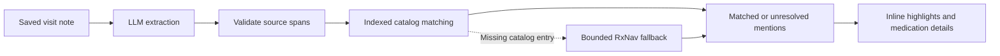

# Proposed solution: medication detection in visit notes

Use an LLM to extract medication mentions from the note, then resolve those
mentions against an indexed RxNorm catalog. The model helps interpret messy
language; verified catalog records supply medication identities and structured
attributes.

The core first pass is now implemented: structured LLM extraction, validated
source spans, indexed catalog matching, and accessible highlights/details with
loading, error, retry, and unresolved states. The design below also includes
follow-up work beyond the exercise's 45-minute timebox.

First-pass scope and tradeoffs:

- One OpenAI extraction call per saved-note view; `LLM_API_KEY` is required.
- Exact/brand/synonym lookup, four explicit shorthand expansions, and conservative
  fuzzy matching over at most 64 retrieved aliases. Ambiguous matches abstain.
- Model-suggested names are collected but deliberately do not override lexical
  evidence in this pass. Short unknown abbreviations remain unresolved.
- Local catalog only during analysis; live fallback, strength/form extraction,
  product matching, and import-job hardening remain follow-up work.
- Local ORM/import commits invalidate the index; a 60-second TTL bounds staleness
  from other processes or external writes. Index rebuilding is lazy.
- Notes are capped at 20,000 characters and 200 extracted mentions. Editing
  aborts the browser request, though an in-flight provider call can still finish.
- Deterministic tests mock the LLM. Live checks with the configured model are
  recorded below; repeat them when changing the prompt or model.

First-pass verification: all 73 backend tests pass, including both transcript
answer keys with mocked extraction; the frontend TypeScript/Vite build passes.
Live extraction with the default `gpt-4.1-mini` returns all 7 expected mentions from
transcript 01 and all 12 from transcript 02, with correct spans, RxCUIs, match
types, and corrections. Those live checks used 14,689 RxNav ingredient concepts
plus seed brand aliases in memory, without changing the application's catalog.
With only seed data, MTX, vitamin D, and folic acid remain unresolved as expected.
The checks did not fetch full brand enrichment and are not a general accuracy
benchmark.

Live testing exposed global list numbering in the model's occurrence field and
omitted references in dosing discussions. The prompt now explicitly requires
per-name literal occurrence counts and mentions across all note sections,
including pharmacy confirmations and dosing discussions. The anchoring code
also recovers an incorrect number when the literal name occurs exactly once;
ambiguous repeated text still requires a valid occurrence. Regression tests
cover this distinction, including a non-medication ASA score before an ASA
medication mention.

An additional live example combined Unicode, an ASA physical-status score,
ASA medication use, APAP, and negated aspirin use. Small models incorrectly
treated the ASA score as medication, so anchoring now excludes explicit ASA
score/class phrases with a numeric or Roman-numeral value. `gpt-4o-mini` also
omitted the negated aspirin mention; `gpt-4.1-mini` retained it and passed both
supplied notes, so it is the new default. `LLM_MODEL` remains configurable.
The extra example now passes, but this narrow guard is not a general solution
to all ambiguous abbreviations.

The provider request uses strict JSON-schema output, following the
[official OpenAI structured-output documentation](https://developers.openai.com/api/docs/guides/structured-outputs).

## Analysis flow



### 1. Extract mentions with the LLM

Make one extraction call per analyzed note. Request structured output, validated
with Pydantic, containing:

- The medication text exactly as written.
- Occurrence or surrounding-context information to distinguish repeated text.
- Suggested corrected spelling or abbreviation expansion, when applicable.
- Optional strength and dose form explicitly present in the note.

Include brands, shorthand, misspellings, supplements, and references to held,
discontinued, or negated medications. This feature identifies mentions; it does
not infer an active medication list. Exclude conditions, laboratory values,
scores, and generic phrases such as "blood thinner" that do not identify a drug.

Treat note content as data, including any instructions embedded in it. The model
must not supply authoritative RxCUIs or medication attributes. Its suggested
names are inputs to retrieval and must be checked against catalog evidence.

### 2. Anchor highlights to the original note

Compute offsets in Python by locating each extracted literal substring in the
unchanged note. Use occurrence/context information to disambiguate repetitions;
do not always select the first occurrence or automatically annotate every copy.
Reject invented text and ambiguous or invalid spans.

For each returned mention, enforce:

```python
0 <= mention.start < mention.end <= len(note)
note[mention.start:mention.end] == mention.text
```

Sort spans, remove duplicate spans, and resolve overlaps before returning them.
Keep separate occurrences even when they resolve to the same medication.

Use a consistent offset convention across the API and UI. Python offsets count
Unicode code points, so the frontend can slice `Array.from(analysis.note)` rather
than use JavaScript UTF-16 string offsets directly. This avoids misplaced
highlights after characters such as emoji.

### 3. Retrieve candidates from the entire catalog

Build a reusable in-memory index from the medications table, including all
catalog rows rather than the first page of the medications API:

- An exact lookup map for normalized ingredient names, individual brand names,
  and synonyms. Retain all candidates when an alias maps to multiple concepts.
- A small explicit shorthand map for `HCTZ`, `APAP`, `ASA`, and `MTX`, whose
  expanded names are resolved against verified records.
- A character-trigram inverted index mapping fragments to aliases. Retrieve a
  small shortlist from shared fragments, then rank it using edit distance.

Normalize case and whitespace for retrieval while retaining the original alias
and its kind for display. Preserve meaningful distinctions in medication names.
Use both the written name and validated model-suggested variants as retrieval
inputs; a model suggestion alone is insufficient evidence for a match.

Building an index may scan the catalog once per snapshot. Matching a mention
must not repeatedly scan all approximately 15,000 concepts. In particular, avoid
calling the existing `local_lookup` brand path for every mention: it currently
loads all medication rows and scans their comma-separated brand names.

Store plain immutable records in the index, not live SQLAlchemy objects. Rebuild
after committed seed, scrape, or import changes and atomically publish the new
snapshot. Coalesce import invalidations so the next analysis obtains current
data without rebuilding for every imported row. This approach fits the scaffold's
single-process deployment; multiple workers would need shared catalog versioning
or database-backed alias indexes.

### 4. Resolve conservatively

Apply these rules in order:

1. Resolve exact ingredient, brand, or synonym aliases when unambiguous.
2. Resolve known shorthand expansions, using the mention's context when needed.
3. Rank fuzzy candidates and accept only when similarity is sufficient and the
   winning concept is clearly separated from the next distinct concept.
4. Leave uncertain mentions unresolved with `matched=false` and no fabricated
   medication data.

Choose thresholds using representative examples and test plausible competing
names. Do not fuzzy-match short abbreviations indiscriminately. Multiple aliases
of the same RxCUI should not count as competing concepts. A lexical score is not
a calibrated probability; leave `confidence` unset unless its meaning is defined.

Keep spelling corrections distinct from brand and shorthand mappings:

| Written text | Normalized concept | Match type | Correction shown |
| --- | --- | --- | --- |
| `metformin` | metformin | exact | None |
| `metformn` | metformin | misspelling | `metformn → metformin` |
| `Glucophage` | metformin | brand | None |
| `HCTZ` | hydrochlorothiazide | shorthand | None |
| Misspelled brand | Verified ingredient | misspelling | Written brand → correctly spelled brand |

For a missing local concept, use a bounded, cached RxNav fallback with explicit
timeouts and a per-analysis request budget. Validate the returned concept and
ingredient relationship instead of accepting the first ID. The existing live
lookup can return a non-ingredient term type. Ambiguous or combination products
must not be silently reduced to a single ingredient just to fit the schema.

RxNav approximate search is an optional additional retrieval path. NLM describes
its approximate results as candidates for review, so the top result should not
automatically become a confirmed match. See the
[RxNorm approximate matching documentation](https://lhncbc-portal.lhcaws-prod-pub.nlm.nih.gov/RxNav/news/RxNormApproxMatch.html).

## User experience

Analyze after loading a saved visit and after a successful note save. Keep the
existing textarea for editing. In viewing mode, render the original note as React
text slices interleaved with accessible highlighted controls, preserving spacing
and line breaks.

Clicking or keyboard-focusing a mention opens a detail panel with:

- The original mention and normalized medication name.
- RxCUI, term type, available brand names, drug class, and data source.
- Match type and an explicit spelling correction when applicable.
- Strength and form when extracted from the note.

Use the label **Medication mentions**. Highlight each occurrence; an optional
summary can group entries by RxCUI and show occurrence counts. Distinguish
unresolved mentions with text as well as styling.

Provide loading, retry, no-mentions, and unresolved states. An LLM timeout,
malformed response, or missing configuration must produce an analysis error,
not a successful empty result. Keep the note readable during failures. RxNav
failure can leave individual mentions unresolved without hiding successful
local matches.

Discard results if the visit or saved note changed while analysis was running.
Render highlights only when `analysis.note` matches the displayed note. Avoid
duplicate requests for an unchanged note while the page remains mounted.

## Implementation boundaries

Reuse `MedicationMention` and `NoteAnalysis` in `backend/app/schemas.py`, along
with the corresponding frontend types. Set `implemented=true` once the analysis
path is implemented. Keep the endpoint small and separate responsibilities:

| File | Responsibility |
| --- | --- |
| `backend/app/routers/analysis.py` | Load the visit, orchestrate analysis, return the existing contract and clear errors |
| New extraction module | Provider call, structured-output validation, and source-span validation |
| New matching module | Catalog index, candidate retrieval, resolution, and bounded fallback |
| `frontend/src/pages/VisitPage.tsx` | Analysis lifecycle, saved-note consistency, and integration |
| New note/detail components | Accessible highlights and structured medication details |
| `backend/tests/` | Deterministic extraction, matching, endpoint, and importer regression tests |

Use the existing backend LLM settings and keep the API key on the server. Keep
the current FastAPI, React, Postgres, Docker, and Render architecture.

## Verification

Use mocked LLM output for deterministic tests while exercising the real index
and matching logic. Cover exact names, brands, shorthand, typos, supplements,
repeated occurrences, alias collisions, ambiguous matches, and missing entries.
Also cover fabricated spans, overlapping spans, Unicode, empty notes, malformed
provider output, and provider failures.

The supplied answer keys define these acceptance cases:

| Fixture | Mentions | Unique concepts |
| --- | --- | --- |
| `test-transcripts/transcript-01.txt` | 7 | 6 |
| `test-transcripts/transcript-02.txt` | 12 | 11 |

Check the expected spans, RxCUIs, match types, and corrections—not only counts.
`MTX`, vitamin D, and folic acid are absent from the seed catalog. With only seed
data, they should resolve through a verified fallback or remain unresolved;
after import, verify their local resolution. Test non-medication text and close
competing names against the full catalog to expose false positives.

Replace the existing test that expects an empty analysis stub. Add focused UI
checks for unchanged reconstructed text, keyboard access, and discarded stale
responses. Confirm that repeated lookups reuse the index and rank a candidate
shortlist instead of all catalog rows.

Run the backend tests and frontend production build before delivery, and repeat
the sample-note smoke test on the deployed application. Local verification
results are recorded above; a deployed browser smoke test is still outstanding.

## Stretch goals and priorities

**Strength and form:** extract adjacent text such as `500 mg` or `inhaler` and
include it in the highlight when span validation succeeds. Keep the ingredient
match separate from product identification. Populate `product_rxcui` only after
verifying a compatible RxNorm product; extracted dosage alone is not proof.

**Import data preservation:** the current names-first import calls `_rows_for`
with empty brand/class maps, and `_write` overwrites existing enrichment with
nulls. A failed or disabled enrichment phase can therefore erase valid data.
Make the first pass update names and term types only. Update enrichment only
when its fetch succeeded, distinguishing a verified empty result from unavailable
data. Add regression tests for reimport, disabled enrichment, and failed fetches.

**Further import hardening:** add bounded retries and visible partial-failure
reporting. A daemon thread can also disappear while persisted state remains
`running`, blocking future imports. Proper recovery needs an atomic database job
claim, owner token, heartbeat, and expiring lease. Defer that broader lifecycle
work until the core feature is complete.

## Timebox and delivery

| Budget | Focus |
| --- | --- |
| 5 minutes | Verify setup, configure the LLM, start deployment/catalog import |
| 15 minutes | Implement extraction, span validation, and indexed matching |
| 10 minutes | Integrate highlights, details, and analysis states |
| 10 minutes | Run focused tests, build, and exercise both transcripts |
| 5 minutes | Verify the deployed feature and record the walkthrough |

Treat this as a prioritization budget. If the core flow takes longer, leave
stretch work documented and unfinished. With more time, improve evaluation on
additional notes, context-sensitive ambiguity handling, product/combination
support, shared index invalidation, and import recovery.

Submit the working Render URL, forked repository link, and a short video showing
the feature and explaining matching, uncertainty, testing, and remaining limits.
Include the coding-agent transcript as the optional bonus deliverable.
